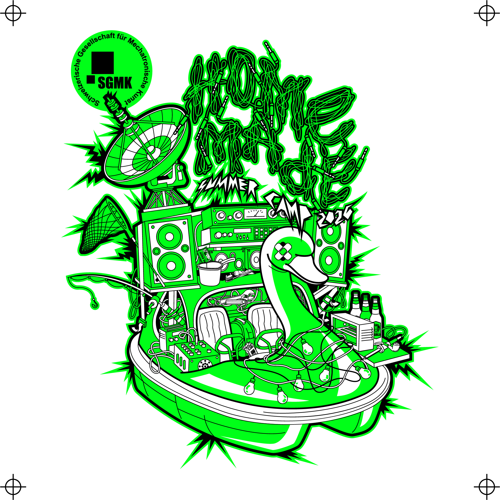
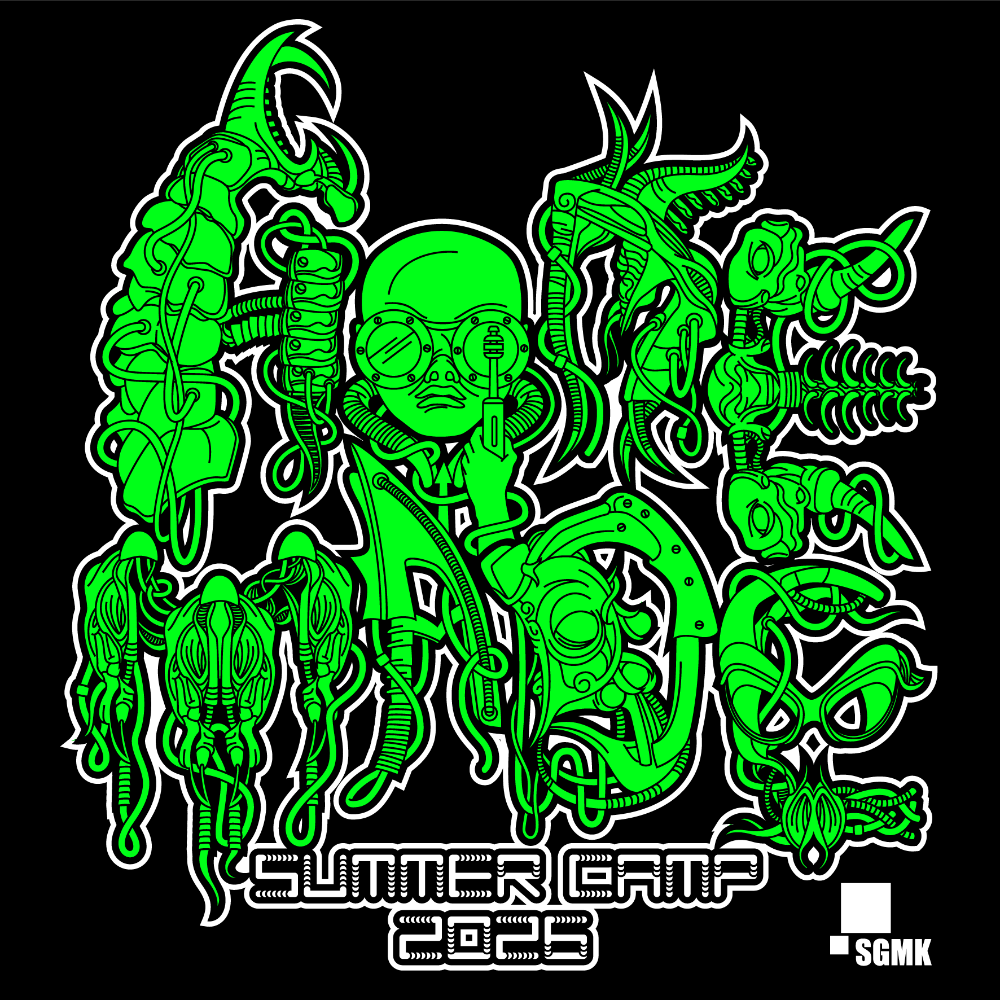
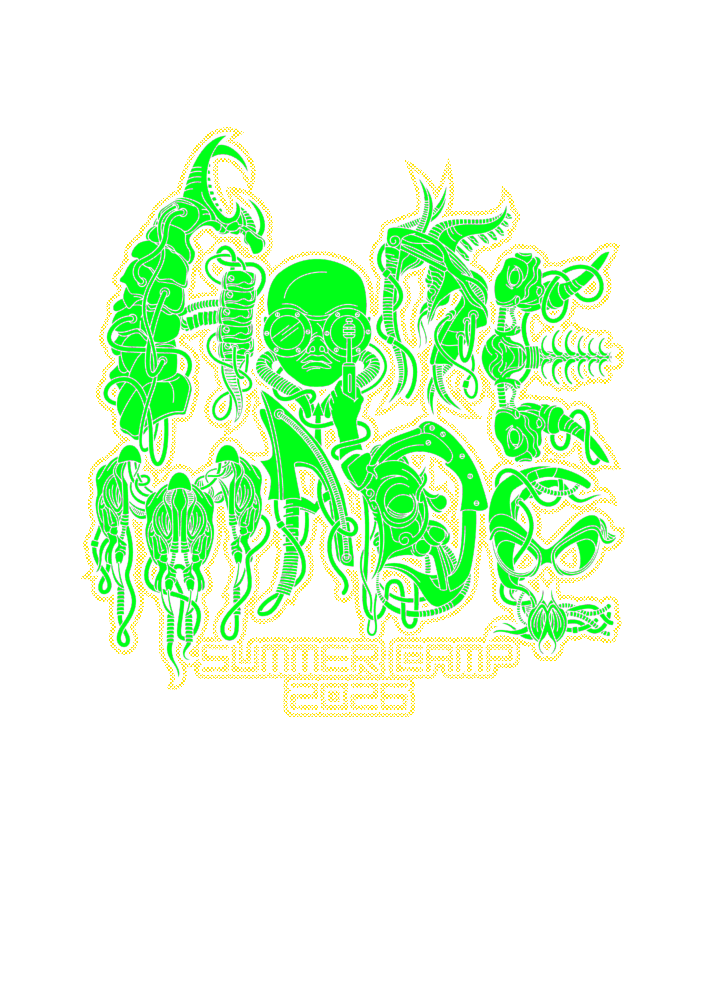
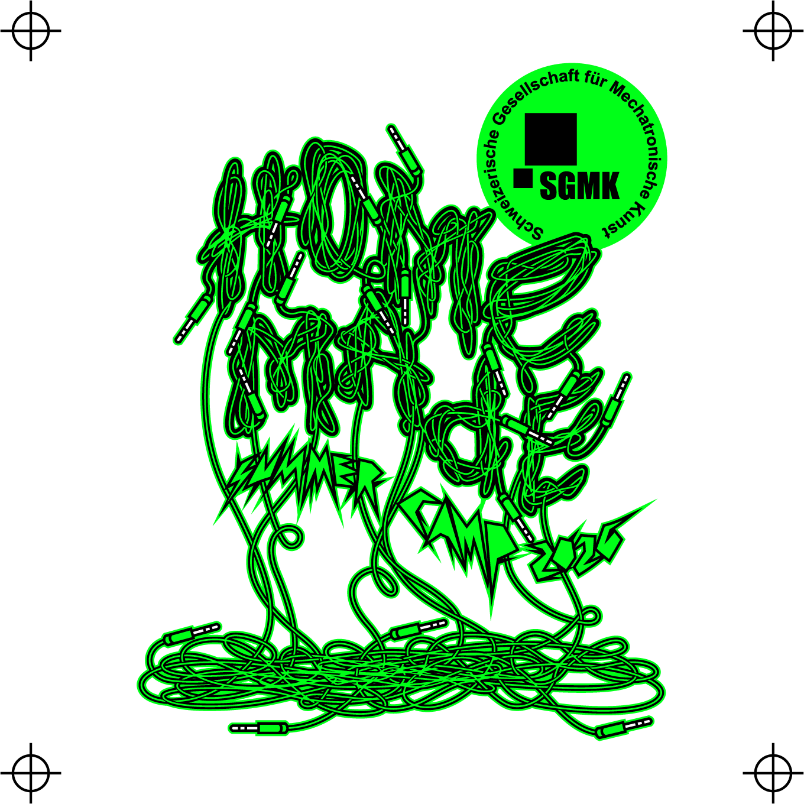
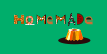

# Home Made 2026 Design

## About HOME MADE 2026

The [HOME MADE summercamp](https://wiki.sgmk-ssam.ch/wiki/HOME_MADE_2026) is an annual, week-long gathering organized by the Swiss Mechatronic Art Society (SGMK) that brings together beginners and experts to explore the intersections of art, technology, and experimental electronics. Continuing a rich DIWO (Do It With Others) tradition that celebrated its 20th anniversary in 2025, the camp is centered around open-ended research, skill-sharing, and community building, where participants collaborate on projects involving sound, light, kinetic art, and a diverse array of other creative practices.

The 2026 edition takes place from July 25 to August 1 at Berghaus Girlen in Ebnat-Kappel. During this self-organized research week, participants will co-create a dynamic program of workshops (such as LoRa Mesh networking and custom USB devices), spontaneous AV jams, and communal cooking, culminating in a closing party in Zurich. It offers a unique open laboratory atmosphere for makers, artists, and families to experiment, learn, and relax in a beautiful mountain setting.

This directory contains the official design assets and graphical materials for **Home Made 2026**.

## Credits

- **Main Design, Giger Variant, and Logo by:** Helmi Hardian
- **Kuchen (Flyer) Design by:** PascalM

## Example Images

Here are some preview images from the design collection:

### Main Design

### Giger Variant

### Logo

### Kuchen Flyer

## Available Files & Formats

This folder includes various scalable vector and high-resolution raster files:
- **Vector formats:** `.ai` (Adobe Illustrator), `.eps`, `.pdf`, `.svg`
- **Raster formats:** `.png`, `.jpg`
